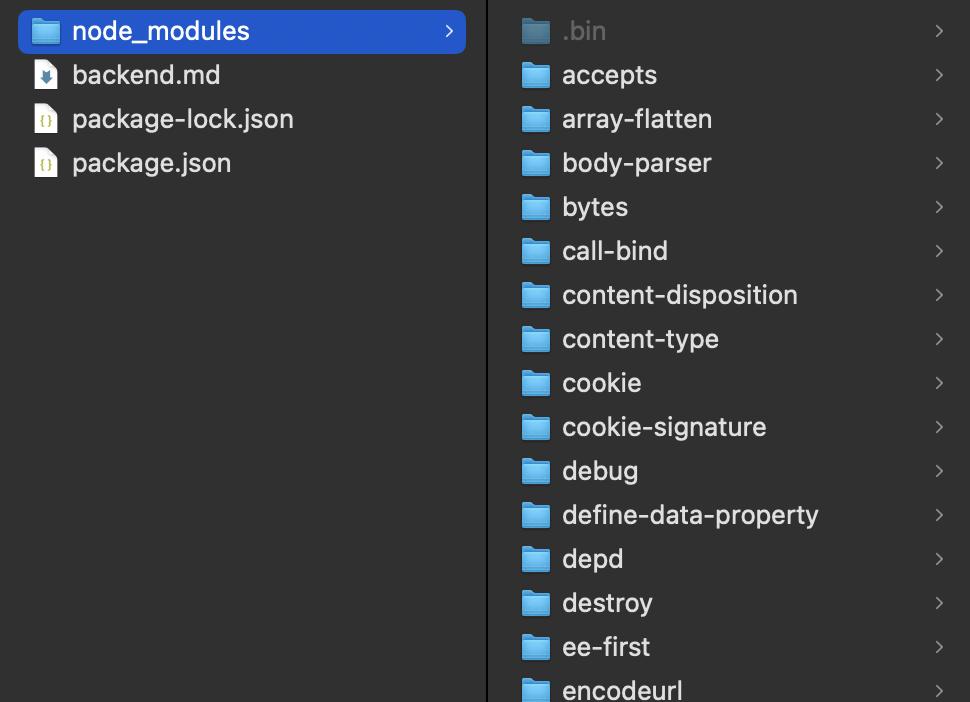

# Changes when install express

執行 `npm install express` 後，console 會顯示

```
added 65 packages, and audited 66 packages in 818ms

13 packages are looking for funding
  run `npm fund` for details

found 0 vulnerabilities
```

表示執行這行指令，npm 幫總共幫我們安裝了 65 個 packages（express 和它的相依套件們）

`audit`：安全性檢查。檢查這些套件有沒有漏洞

`found 0 vulnerabilities` 表示找到 0 個漏洞

## Changes

### `package.json`

新增 dependencies，裡面會有剛剛安裝的 package 名稱跟版本

```json
"dependencies": {
    "express": "^4.21.0"
}
```

`^4.21.0`：

希望安裝的 Express 版本是 `4.21.0` 或「兼容的更高版本」例如 `4.21.x` 或 `4.x.x`，但不會自動升級到 不兼容的主版本（`5.x.x`）

簡單來說，可以匹配的版本號就是 `>= 4.21.0 且 < 5.0.0`

---

### node_modules 資料夾

node_modules 資料夾裡會新增剛剛提到的那 65 個 package 的檔案


