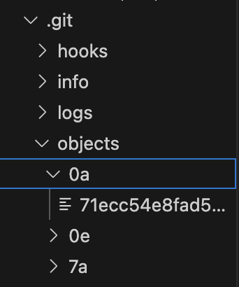
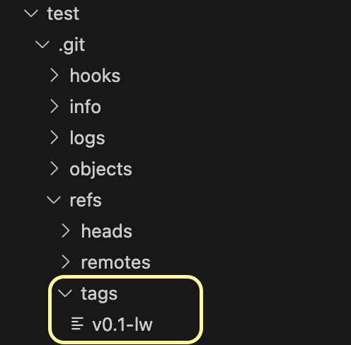
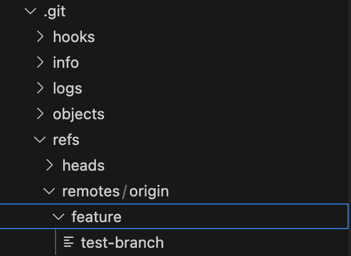
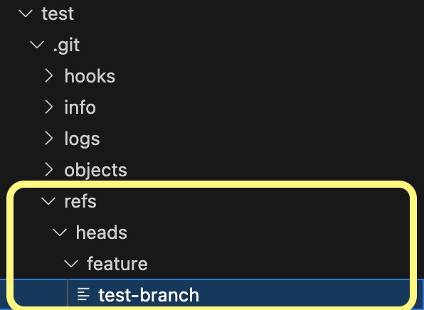

# Git 概念介紹

## 1. Git 的資料結構

Git 有兩個重要的資料結構：「物件」與「索引」

### 1.1 物件

- 保存版本庫中所有檔案與版本紀錄
- 所有物件預設會存在 `.git/object` 的資料夾中
- 檔名都是以**檔案內容**進行雜湊運算算出的算出的雜湊值。取前兩個字元為資料夾命名，剩下的則用來為檔案命名
    - 例如下圖中的 0a 資料夾和 71ec... 檔案

    
- 所有的物件都會以 zlib 演算法進行壓縮
- **四種物件類型：blob, tree, commit, tag**
- 相關 command
    - `git cat-file -p <HASH>` 可以印出內容 
    - `git cat-file -t <HASH>` 可以印出物件類型


#### Blob 物件 (Binary large Object)

- 用來存儲檔案內容的物件，內容以二進制的形式儲存
- 執行 `git add` 後，**新增檔案**的**內容**就會被寫入成為 blob 物件
- 如果在 commit 後修改之前已經存在的檔案，再次執行執行 `git add` 後，新的修改會產生一個新的 blob
- 範例 ： 

    command
    ```
    git cat-file -p e32092a83f837140c08e85a60ef16a6b2a208986 
    ```
    output
    ```
    version 1
    ```

#### Tree 物件

- 在執行 `git commit` 後被生成
- 存儲當前目錄狀態的物件，內容包含
    - Blob、其他子 Tree（子目錄）的列表
    - 每個 Blob 或 Tree 的文件名和指向其內容的指針
- 讓 Git 能夠重現文件系統的結構
- 範例 ： 

    command
    ```
    git cat-file -p 3099e6bf7c09729ba030faa2eda3655ea730c7c1 
    ```
    output
    ```
    100644 blob e32092a83f837140c08e85a60ef16a6b2a208986    README.md
    ```
#### Commit 物件
- 在執行 `git commit` 後被生成
- 內容包含
    - 被包含在這個 commit 中的 tree 物件
    - 版本提交的時間
    - commit message
- 範例：

    **第一個 commit**

    ```
    git cat-file -p e7b3162b2aa3970764ac0d7adbce6041f58f8438 
    ```

    ```
    tree 3099e6bf7c09729ba030faa2eda3655ea730c7c1
    author yunsi <mail> 1726234649 +0800
    committer yunsi <mail> 1726234649 +0800

    version 1 # commit message
    ```

    **第二個 commit**

    ```
    git cat-file -p 589a5e5376e8aa151b3b74076fcb448ad4a374e9
    ```

    ```
    tree 0320473e4458ccdf4b577a8c6e81d75b315d85fc
    parent e7b3162b2aa3970764ac0d7adbce6041f58f8438
    author yunsi <mail> 1726234834 +0800
    committer yunsi <mail> 1726234834 +0800

    version 2 before push
    ```

    - parent: 上一個 commit
    - +0800: 時區偏移量

#### Tag 物件

- 通常會指向某個 commit 物件，就像貼在 commit 上的標籤（也可以指向別的物件）
- 常用於標記某個版本號碼，e.g. v0.0.1，做版本管理
- 有兩種
    <details>
    <summary>lightweight tag</summary>
        
    - 只會指向一個特定的 Git 物件
    - `git tag v0.1-lw e7b3162b`，在第一個 commit 貼一個 tag
        
    ```
    git tag v0.1-lw e7b3162b
    ```
    ```
    commit e7b3162b2aa3970764ac0d7adbce6041f58f8438 (tag: v0.1-lw)
    Author: yunsi <110306079@g.nccu.edu.tw>
    Date:   Fri Sep 13 21:37:29 2024 +0800

        version 1

    diff --git a/README.md b/README.md
    new file mode 100644
    index 0000000..e32092a
    --- /dev/null
    +++ b/README.md
    @@ -0,0 +1 @@
    +version 1
    ```
    </details>

    <details>
    <summary>annotated tag</summary>
        
    - tag ref 會指向 tag 物件，而 tag 物件會指向一個特定的 Git 物件

    內容（一樣貼在第一個 commit）
    ```
    tag v0.1
    Tagger: yunsi <mail>
    Date:   Sat Sep 14 10:59:17 2024 +0800

    v0.1-annotated

    commit e7b3162b2aa3970764ac0d7adbce6041f58f8438 (tag: v0.1-lw, tag: v0.1)
    Author: yunsi <mail>
    Date:   Fri Sep 13 21:37:29 2024 +0800

        version 1

    diff --git a/README.md b/README.md
    new file mode 100644
    index 0000000..e32092a
    --- /dev/null
    +++ b/README.md
    @@ -0,0 +1 @@
    +version 1
    ```
    </details>

### 1.2 索引 (index)

- 通常會放在 .git/index
- 紀錄「有哪些檔案即將要被提交到下一個 commit 版本中」

    ```
    git ls-files -s
    ```
    ```
    100644 61750746c5aadd23e453a5805a773fd2f06f755c 0       README.md
    100644 30d74d258442c7c65512eafab474568dd706c430 0       test.txt
    100644 4f67a836c51f3066d8ce59a68c2b58b9bc651948 0       test1.txt
    ```

## 2. Git 的 指標

### 2.1 Branch

當要開發新功能時，視情況，不過通常會從 main/master 開一個新的分支進行開發

而分支其實有以下細節
- 一個指向特定 Commit 的可變指標
- 通常存在 `.git/refs` 目錄內
- 功能：
    - 允許在不同的功能或修復之間進行分隔
    - 允許同時進行多個功能開發
- 當在某個分支上提交一個新的 commit，這個指標會移動到那個新的 Commit
- 範例
    - 從 main 新增一個 branch，命名：feature/test-branch
    

### 2.2 HEAD

- 功能：標識當前工作目錄狀態的指標
- 機制：
    - HEAD 會指向當前的 Branch（`.git/HEAD`）
    - 當前的 Branch 會指向該分支的末端（最新的 commit）

    

    test-branch 中就是 被指向的 commit 的雜湊值

## 3. 常見 Git 操作帶來的變化

上方以 Git 物件和指標為主角，而接下來將以 git 常見的操作作為主角，描述 不同 git command 會對 `.git` 資料夾帶來什麼變化

### 3.1 `git add` (one file)

- 生成一個 Blob，在 `.git/objects` 目錄下
- `.git/index` 會多一筆這個檔案的紀錄

### 3.2 `git commit`

- 生成一個 tree 和一個 commit 物件
- 當前的 branch 會指向這個新 commit
    - `.git/refs/heads/...` 中檔案的內容會更新成新的 commit 的雜湊值
- 新增一筆 log
    - `.git/logs/refs/heads/...` 中檔案的內容會新增一比紀錄
        - e.g.
            ```
            ba64beafa4555d6a3629162343cba3d1c5c29a50 984db8d01af6e008a66f6d793155e458b7df6878 yunsi <mail> 1726290371 +0800	commit: Test commit
            ```

#### 補充 - commit message 怎麼寫

以我自己的經驗來說，因為在寫大專案的時候會搭配專案管理工具，例如 jira，所以每個功能開發都會有一張票。因此在寫 commit message 時都會在開頭加上 **票的編號**，後面再簡短街上這個 commit 做了什麼的敘述。

如果兩個應用有連接，那麼就可以直接透過編號導到該 commit 的票

e.g. GP-130 Add ... feature

網路上也有一些寫 commit message 的指導，例如很多篇文章提到的：
> 
    Header: <type>(<scope>): <subject>
    
    Body:
    
    Footer: 任務編號


至於到底要使用什麼寫法，就要因應不同團隊的開發流程或專案管理方式來決定一個統一的標準。

### 3.3 `git push`

以下在 commit 時新增的內容會被紀錄到 remote/origin 資料夾
- branch 指標
- head 指標
- log 紀錄

`.git/refs/heads/...` -> `.git/refs/remotes/origin`
`.git/logs/refs/heads/...` -> `.git/logs/refs/remotes/origin`

### 3.4 `git checkout -b`

動作：新增並切換到該 branch（如果 branch 已經存在就會是單純的分支切換）

以下為新增 branch 的變化 

- `.git/HEAD` 內容改變
    - e.g. `ref: refs/heads/main` -> `ref: refs/heads/feature/test-branch`
- 新的
    - branch、head 指標（`.git/refs/heads/...`）
    - log 紀錄（`.git/refs/remotes/origin`）


## 資料來源
- [30 天精通 Git 版本控管](https://github.com/doggy8088/Learn-Git-in-30-days)
- [解剖 .git 資料夾 part. 2 - Blob Object](https://blog.simonxander.tw/2023/12/dot-git-folder-part-2.html)
- [深入 Git：Git 物件儲存 - tag 物件](https://titangene.github.io/article/git-tag-object.html)