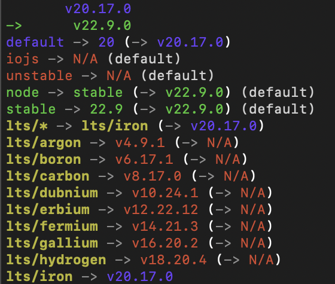
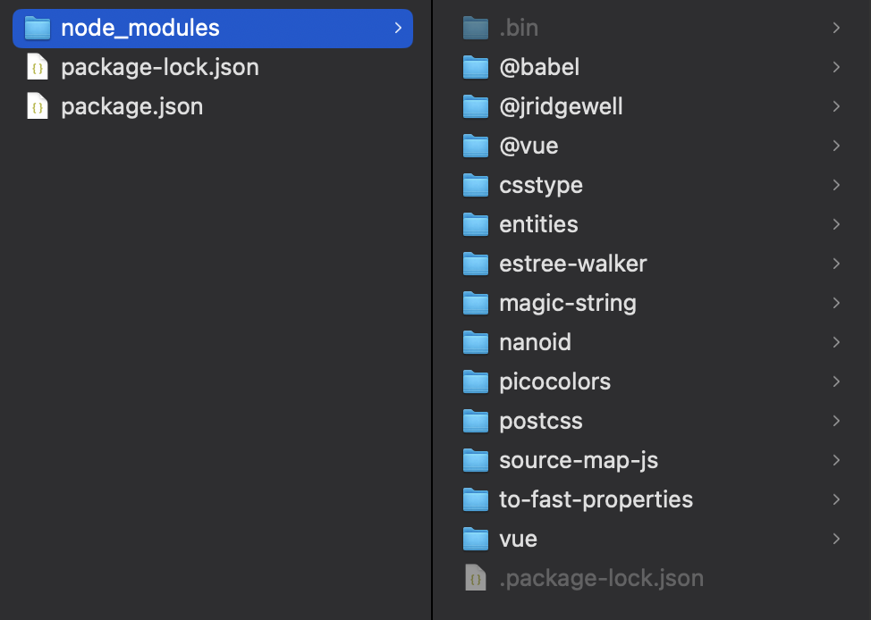

## 技術選型

Node.js 版本選擇：v20.17.0

原因：9/19 小組討論後決定使用 mode.js 20，因為 20 是 node.js 目前最新的 lts 版本

## nvm vs. npm

### nvm（Node Version Manager）

- Node.js 的**版本管理**工具
- 需要的原因：
    
    不同專案可能會用到不同版本的 Node.js，這時候就可以透過 nvm 下載或切換不同版本的 Node.js，來配合開發
- 常見指令：
    - `nvm install 20`：安裝 node.js 20
        - 也可以指定更細的版號 e.g. `nvm install 20.17.0`
    - `nvm ls`：列出自己有安裝的 Node.js 版本
        - e.g. 在本地用 nvm 下載 node.js 20 和 22，`nvm ls` 執行結果如下

            
    - `nvm alias default $vserion`：修改預設開啟的 Node.js 版本（上圖的 default）
    - `nvm -h`：可以看到所有指令

---
### npm（Node Package Manager）

- node.js 的**套件管理**工具，會在下載 node.js 時一起被安裝
- 套件可以在 https://www.npmjs.com 上搜尋

#### ◆ 如果想在專案中使用 npm

執行`npm init`

執行後需要再輸入一些專案設定，例如專案名稱、專案版本等，執行完畢就會在資料夾中看到 `package.json` 和`package-lock.json` 兩個檔案。

- `package.json`：放專案設定
    ```
    {
        "name": "node_practice",
        "version": "1.0.0",
        "description": "practice",
        "main": "index.js",
        "scripts": {
            "test": "echo \"Error: no test specified\" && exit 1"
        },
        "author": "yunsi",
        "license": "ISC"
    }
    ```
- `package-lock.json`（下方有範例）
    - 紀錄依賴版本、依賴的來源網址，以此固定專案使用的各個依賴的版本
    - 協助檢查依賴的完整性

> 
    名詞介紹：
    Dependency（依賴）：自己的專案使用的外部套件（package）被稱為依賴

#### ◆ 如果想安裝外部套件（以安裝 vue 為例）

- 如果**沒有**一個已經寫好要使用什麼依賴的 `package.json`  檔案 => 執行 `npm install vue`
    
    檔案變化
    - `package.json` 會新增 dependencies，裡面有一行 vue 和 vue 的版本
        ```
        {
            "name": "node_practice",
            "version": "1.0.0",
            "description": "practice",
            "main": "index.js",
            "scripts": {
                "test": "echo \"Error: no test specified\" && exit 1"
            },
            "author": "yunsi",
            "license": "ISC",
            "dependencies": {
                "vue": "^3.5.6"
            }
        }

        ```
    - 多出一個 `node_modules` 資料夾，裡面裝剛剛安裝的依賴
        - 通常 `node_modules` 不會被上傳和共用
    
            

    - `package-lock.json` 會新增所有依賴的資料，e.g.

        截取內容
        ```
        "node_modules/@vue/compiler-core": {
            "version": "3.5.6",
            "resolved": "https://registry.npmjs.org/@vue/compiler-core/-/compiler-core-3.5.6.tgz",
            "integrity": "sha512-r+gNu6K4lrvaQLQGmf+1gc41p3FO2OUJyWmNqaIITaJU6YFiV5PtQSFZt8jfztYyARwqhoCayjprC7KMvT3nRA==",
            "license": "MIT",
            "dependencies": {
                "@babel/parser": "^7.25.3",
                "@vue/shared": "3.5.6",
                "entities": "^4.5.0",
                "estree-walker": "^2.0.2",
                "source-map-js": "^1.2.0"
            }
        },
        ```
- 如果有，那麼只要執行 `npm install`，npm 就會去讀`package.json`和`package-lock.json`的設定，安裝需要的 dependencies

---

### 小總結
總結來說， nvm 是用來管理 node.js 的版本；npm 則是用來管理專案所用到的套件。


## 資料來源
- [node.js 官網](https://nodejs.org/zh-tw/download/package-manager)
- [【Node.js】利用 NVM 來輕鬆管理不同專案的 Node.js版本(macOS 版)](https://medium.com/@NeroHin/node-js-利用-nvm-來輕鬆管理不同專案的-node-js版本-macos-版-a1c588871779)
- [史上最強套件管理 - NPM ， npm init 與 npm install (Day11)](https://ithelp.ithome.com.tw/articles/10191682)