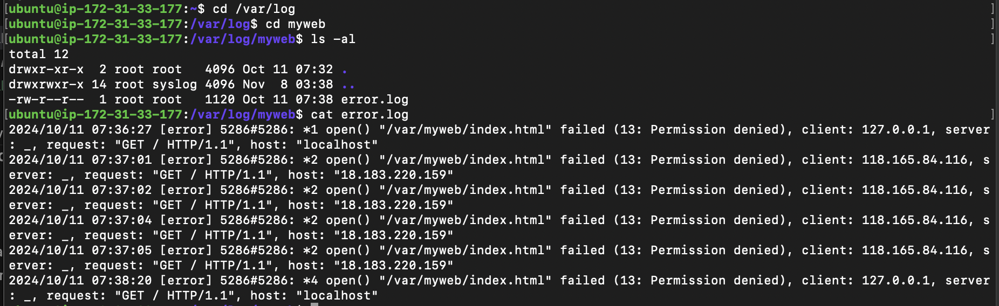
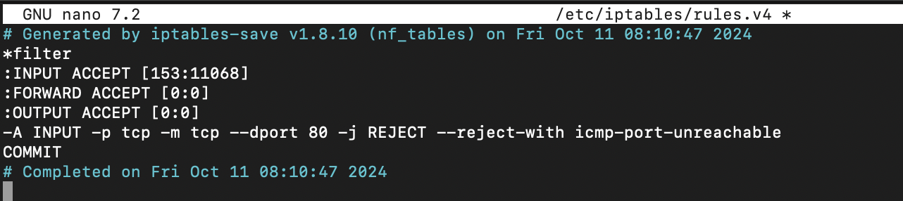

# Troubleshooting Lab

心得：[Link](./thought.md)

除錯步驟如下：

1. [Nginx](#nginx)
2. [防火牆](#防火牆)
3. [File permissions](#file-permission)

[進階：讓 instance reboot 後仍正常運作](#reboot-instance)

## Nginx

### 1. 嘗試啟動 nginx

#### 指令：`sudo systemctl start nginx`


**發現**：nginx 沒辦法啟動

### 2. 檢查 nginx 設定檔

#### 指令：`sudo nginx -t`


**發現**：nginx.conf 有語法錯誤，導致測試失敗

### 3. 修改 nginx 設定檔

#### 指令：`sudo nano /etc/nginx/nginx.conf`


**發現**：worker_connections 那行多了一個分號

修改後重新測試 nginx


測試成功了！

但再次執行 `sudo systemctl start nginx` 還是無法啟動

### 4. 檢查 nginx 狀態

#### 指令：`sudo systemctl status nginx`


**發現**：port 80 已被佔用

### 5. 解決 port 80 被佔用的問題

#### 指令：`sudo lsof -i :80`


**發現**：有一個名字是 srv 的 service 正在佔用 port 80

→ 查看 srv 詳細資料

#### 指令：`ps -fp 575`

```
UID          PID    PPID  C STIME TTY          TIME CMD
root         575       1  0 03:38 ?        00:00:00 /usr/local/bin/.lab/srv
```

**發現**：`UID = root`, `PPID = 1` → 系統初始化時啟動的

#### 指令：`systemctl list-units | grep srv`

因為使用 systemd 管理這個 NGINX web server，所以用這個指令找找有沒有 srv 相關的文件

```
  srv.service                                                                  loaded active running   Another Web Srv
```

**發現**：有一個 srv.service

→ 查看內容

#### 指令：`systemctl cat srv.service`

```
# /usr/lib/systemd/system/srv.service
[Unit]
Description=Another Web Srv
After=syslog.target

[Service]
Type=simple
PIDFile=/run/your-go-program.pid
ExecStart=/usr/local/bin/.lab/srv

[Install]
WantedBy=multi-user.target
```

→ 確定這是一個不必要啟動的 service 後，可以透過指令將其自動啟動的設定停用

#### 指令：`sudo systemctl disable srv.service`


→ 也要把目前正在執行的 kill 掉

#### 指令：`sudo kill [PID]`


沒有 process 佔用 port 80 了！

→ 啟動 nginx 並查看狀態

-   `sudo systemctl start nginx`
-   `sudo systemctl status nginx`


成功啟動了

## 防火牆

### 1. 使用 curl localhost 還是被拒絕連線

思考：nginx 成功啟動了，還有什麼會阻擋連線 → 防火牆

### 2. 檢查防火牆

#### 指令：`sudo iptables -L`


**發現**：INPUT 中有一條規則拒絕 tcp 連線

### 3. 移除規則

#### 指令：`sudo iptable -D INPUT [line number]`


## File Permission

### 1. 再次使用 `curl localhost`


**發現**：403 Forbidden

### 2. 查看 access.log

#### 指令：`cat /var/log/myweb/error.log`



**發現**：存取檔案時被拒絕

### 3. 解決檔案權限問題


**發現**：其他使用者沒有權限讀取 index.html

#### 指令：`sudo chmod 644 [path to index.html]`


修改後就成功了！


## 讓外部使用者透過 public ip acces

方法：設定 `/etc/nginx/sites-available/defalt`


再啟動 nginx 後就可以透過 public ip access 這個服務了


## 

## Reboot instance

**發現兩個問題**：

-   nginx 沒有自動啟動
-   防火牆規則被改回原本的

解決步驟如下

### 1. 讓 nginx 在 instance 啟動時自動啟用

#### 指令：`sudo systemctl enable nginx`


### 2. 修改防火牆規則

找到防火牆設定並修改



-   將 REJECT 改成 ACCEPT
-   將 `-reject-with ... unreachable` 拿掉（如下圖）


這樣當 instance 被 reboot，外部使用者還是可以透過 public ip 來 access 這個服務
